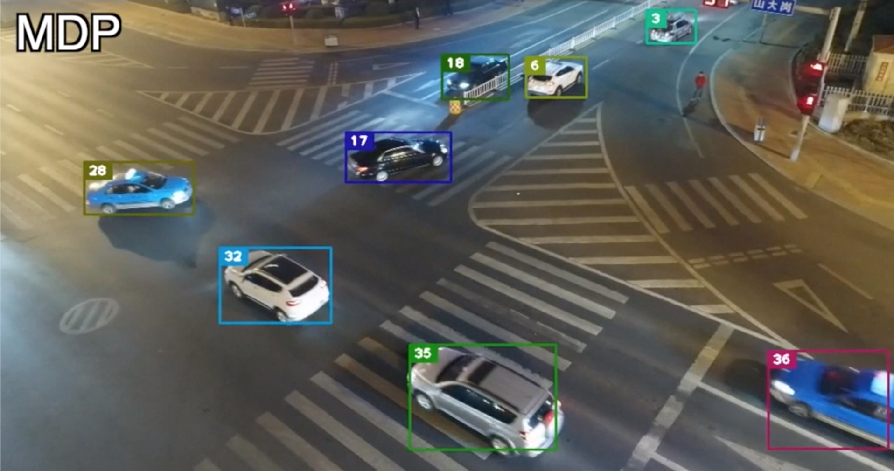

# detection-and-tracking-from-uav
This repo regroup the code from different repository and my own code I used during my project


Example from the `result` folder (tracking on vehicles)

## Credits
by folder

[Darknet](https://github.com/pjreddie/darknet) - YoloV3 implementation  
[Tensorflow](https://github.com/tensorflow/models/tree/master/research) - Object detection api. Faster R-CNN, SSD, R-FCN implementations  
[Deep Sort](https://github.com/nwojke/deep_sort) - Simple Online Realtime Tracking with a Deep Association Metric  
[IOUT](https://github.com/bochinski/iou-tracker) - Python implementation of the IOU Tracker  
[MDP](https://github.com/yuxng/MDP_Tracking) - Learning to Track: Online Multi-Object Tracking by Decision Making  
[UAV Dataset](https://sites.google.com/site/daviddo0323/projects/uavdt?authuser=0) - Used benchmark to compare the methods  

## Dataset

I use the [UAVDT Benchmark](https://sites.google.com/site/daviddo0323/projects/uavdt?authuser=0) created to boost the research. It contains 16592 testing images. 361055 cars, 7234 buses and 7595 trucks are annotated in this set.  

## Detecting vehicles

I tested 4 models:

- Faster R-CNN
- R-FCN 
- SSD
- YOLO

I used the official [darknet repo](https://github.com/pjreddie/darknet) and the tensorflow's [object_detection api](https://github.com/tensorflow/models/tree/master/research/object_detection)

The instructions can be found respectively [here](https://pjreddie.com/darknet/yolo/) for Yolo and [here](https://github.com/tensorflow/models/tree/master/research/object_detection/g3doc) for the 3 other methods.  

In addition, my notebooks `tensorflow.ipynb` and `darknet.ipynb` shows the pipeline I used to train the models (Runned on Google Colab backend).  

## Tracking

I tested 3 algorithms:

- [MDP](https://github.com/yuxng/MDP_Tracking) (Uses Matlab)
- [DSORT](https://github.com/nwojke/deep_sort)
- [IOUT](https://github.com/bochinski/iou-tracker)

Each one works differently

### MDP
Uses Matlab. The instructions can be found in the repository.

### DSORT
We first need to generate the features. The result from the detector should be in the MOT16 challenge format
```
# from the /DSORT/deep_sort directory an example of execution would be:
python tools/generate_detections.py \
    --model=../model/mars-small128.pb \
    --mot_dir=../results/rfcn/ \
    --output_dir=../results/rfcn-features/
```
Then we can run the tracking:  
```
python deep_sort_app.py \
    --sequence_dir=/path_to_videos/M0701 \
    --detection_file=../results/rfcn-features/M0701.npy \
    --min_confidence=0.3 \
    --nn_budget=100 \
    --display=True \
    --output_file=../results/rfcn/M0701-track.txt
```

### IOUT
An example of command is (runned from the /IOU/ directory):
```
# seqmaps/rfcn-all.txt    is the path to the txt file containing the list of videos name, one per line
# res    is the output directory
# /path_to_2DMOT2015/test    in the mot2015 challenge format

./mot16.py -m seqmaps/rfcn-all.txt -o res -b /path_to_2DMOT2015/test -sl 0 -sh 0.8 -si 0.3 -tm 3
```

